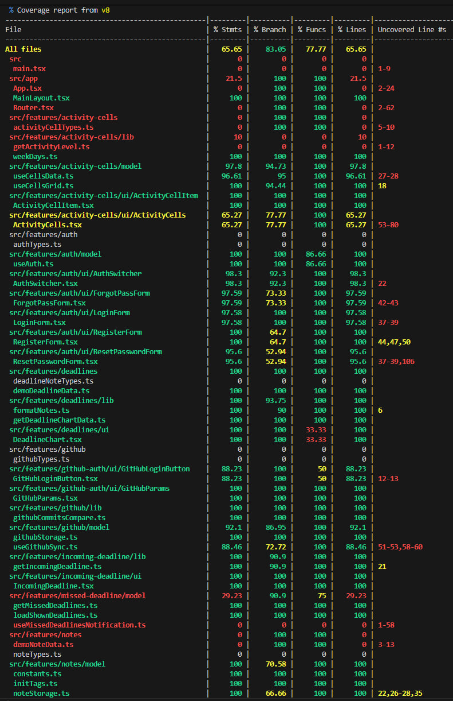

 


# Dev Tracker
Сервис для отслеживания прогресса в разработке — управление задачами, система здоровья и опыта, магазин и интеграция активности GitHub

🔗 [Демо](https://dev-tracker-client.vercel.app/)

---

## 📌 О проекте
Dev Tracker — это веб-приложение, которое помогает разработчикам:

- вести учёт активности через заметки, их статусы и сроки
- визуализировать прогресс (диаграммы, статистика)
- видеть ближайшие дедлайны
- наладить дисциплину посредством потери здоровья и опыта за просроченные дедлайны

---

## 🔨 Технологии

### Frontend
- React + TypeScript
- SCSS
- React Hook Form (для форм и валидации)
- React Query + Axios (для работы с API, кеширования)
- Recharts (для построения графиков)
- React Router DOM (для роутинга)
- Context API (для глобального состояния)
- Vite (для сборки)
- Vitest, React Testing library (для тестирования)

### Backend
- Node.js + Express
- TypeScript   
- JWT (авторизация)
- Multer (работа с файлами)
- GitHub API для учёта активности в GitHub

---

### Тестирование:
Проект покрыт тестами с использованием Vitest и React Testing Library. Покрываемость отображена в виде таблицы:


---

## 📦 Запуск и установка проекта
Клонируй репозиторий:
```
git clone https://github.com/LizKa2091/dev-tracker.git
cd dev-tracker
```
Для работы проекта необходимо создать файл `.env` в директории `frontend`, добавить `VITE_API_BASE_URL` (url сервера для запросов, рекомендуется http://localhost:5001):
```
VITE_API_BASE_URL="http://localhost:5001"
```
И создать файл `.env` в директории `backend`, добавить `JWT_SECRET`, `JWT_REFRESH_SECRET`, `GITHUB_CLIENT_SECRET`, `GITHUB_CLIENT_ID`, `CLIENT_URL`
### Frontend
Установите пакеты: <br />
```
cd frontend
```
```
npm install
```
```
npm run dev
```

### Backend
Установите пакеты: <br />
```
cd backend
```
```
npm install
```
```
npx ts-node server.ts
```
